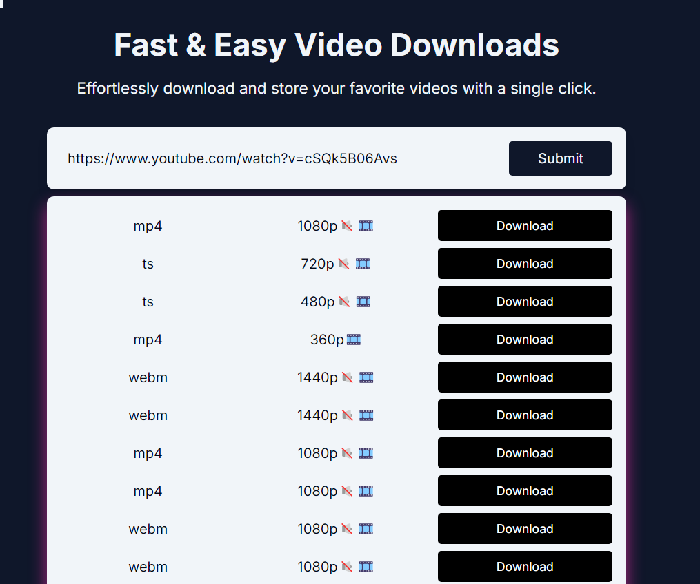

# DownloadDash

DownloadDash is a web application that allows users to effortlessly download and store their favorite videos with a single click. Built using Next.js, this application supports multiple languages and provides a responsive user interface for a seamless experience.

## Features

- **Fast & Easy Video Downloads**: Quickly download videos from popular platforms.
- **Responsive Design**: Optimized for various screen sizes and devices.
- **Multi-language Support**: Available in multiple languages for a global audience.
- **Modern UI/UX**: Clean and intuitive design for an enhanced user experience.

## Screenshots

### Home Page



To get started with DownloadDash, follow these steps:

### Prerequisites

- Node.js (v14.x or later)
- npm or yarn

### Clone the Repository

```bash
git https://github.com/deepakcs95/video-downloader
cd download-dash
```
